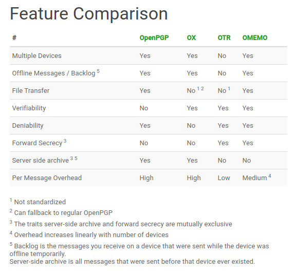

## xmpp-python-omemo

> This repo uses great lib **slixmpp** with omemo plugin :
> https://lab.louiz.org/poezio/slixmpp-omemo/-/tree/master
>
> and ./examples/echo_client.py

Purpose: send encrypted XMPP messages

Please inspect the code and change jid and password for the account that will send messages.


Some decent servers to use:
https://creep.im/ and
https://blah.im/

Be aware that for the first time you'll need to create account using some GUI client and setup mutual subscriptions and check that OMEMO is working.
If in-band registration is available, use your client app (https://gajim.org/ and https://conversations.im/) to register an account.

OMEMO keys by default are stored along the script in *omemo* dir (configurable by data-dir flag)

Public XMPP servers: 
https://list.jabber.at/


Short instructions:
```
sudo pip3 install slixmpp-omemo

nano send_msg.py
chmod +x send_msg.py
./send_msg.py -q  -t "receiver@example.com" -m "Message text"

use flags -d to debug or -q for script to be silent.
```

Encryption compare:

